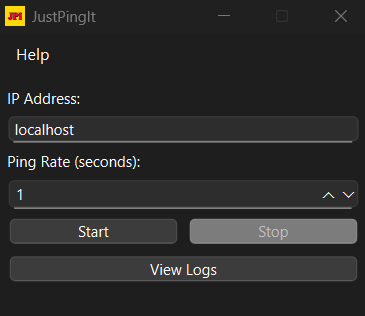

# JustPingIt 🖧📶 

JustPingIt is a Python-based network utility to ping hosts and log responses over time. 
It provides a simple and effective GUI interface for network diagnostics and stores data in a local SQLite database.

---


---

## 📚 Table of Contents

- [🚀 Features](#-features)
- [🧱 Project Structure](#-project-structure)
- [🛠️ How to Run](#️-how-to-run)
- [🗃️ Database](#-database)
- [🎨 Icons and Visuals](#-icons-and-visuals)
- [📄 License](#-license)
- [🙌 Acknowledgements](#-acknowledgements)
- [🤝 Contributing](#-contributing)
- [📬 Contact](#-contact)

---

## 🚀 Features

- Ping any IP address or hostname
- GUI interface for ease of use
- Background pinging operation for long-term test
- Logs ping responses to a local SQLite database
- Exportable logs for network diagnostics
- Lightweight and executable via PyInstaller

---

## 🧱 Project Structure

```
JustPingIt/
│
├── data/
│   └── img/
│       ├── demo.gif
│       ├── demo.png
│       ├── logo_transparent.png
│       └── JPI.ico            # App icon
│
├── src/
│   └── JustPingIt/
│       ├── __init__.py
│       ├── __main__.py
│       ├── main.py             # Entry point of the application
│       ├── model/              # Business logic and pinging functions
│       │   ├── ping.py
│       │   ├── pinger.py
│       │   ├── path.py
│       │   └── database_logger.py
│       └── view/               # GUI logic
│           └── view.py
│
├── .gitignore
├── requirements.txt           # Project dependencies
├── README.md
└── LICENSE
```

---

## 🛠️ How to Run

### 🔧 Requirements

Install dependencies:

```bash
pip install -r requirements.txt
```

Then launch the app:

```bash
cd src/JustPingIt
python main.py
```

---


## 🗃️ Database

All ping results are logged into a handy SQLite database stored locally.

Want to peek inside? Fire up any SQLite viewer or just use Python’s built-in sqlite3 module.

---

## 🎨 Icons and Visuals



- App icon: `Data/img/JPI.ico`
- Logo: `Data/img/logo_transparent.png`

---

## 📄 License

[MIT](LICENSE) — Feel free to use, modify, and distribute.

---

## 🙌 Acknowledgements

- Python & Standard Libraries
- PyInstaller for packaging
- PySide6 for GUI
- Your inspiration to build useful network tools!

---

## 🤝 Contributing

Got ideas? Bugs? Wanna collab? Just ping me back!

---

## 📬 Contact

gestione.franci@gmail.com
